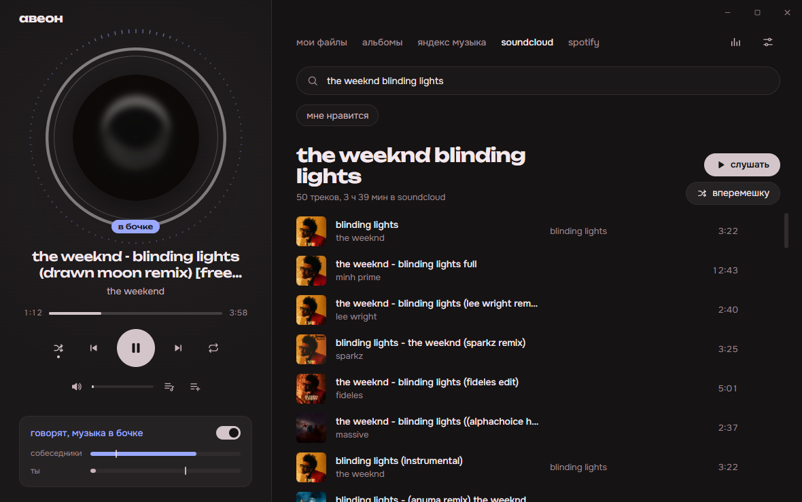
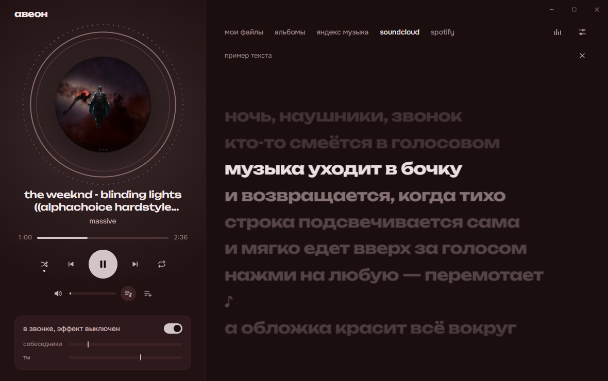
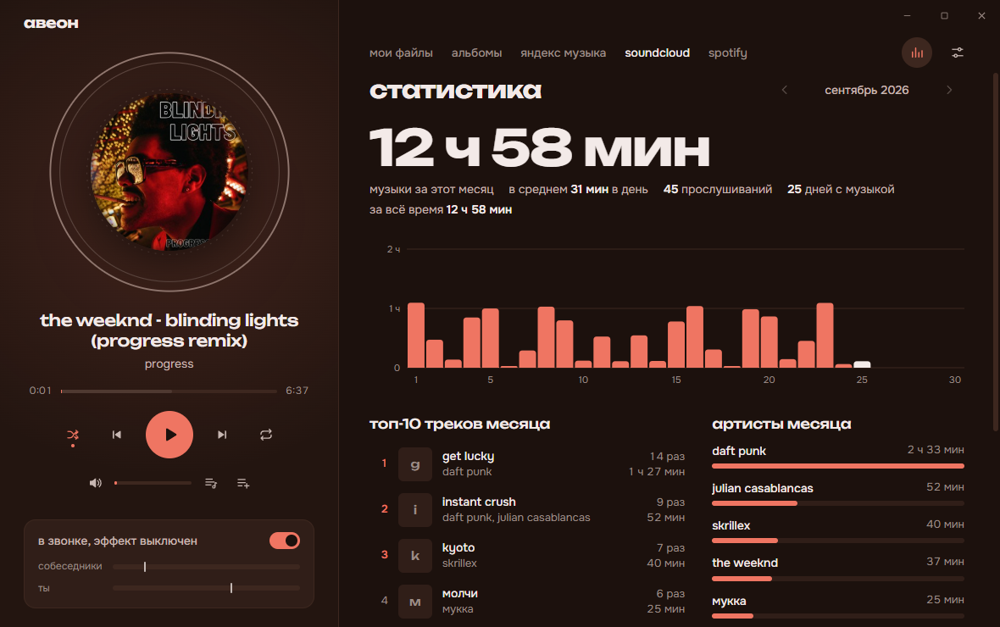

<div align="center">

# авеон

**музыкальный плеер, который уходит «в бочку», когда в discord говорят**




</div>

Слушаешь музыку и сидишь в голосовом канале с друзьями. Как только кто-то начинает говорить,
музыка становится глухой и гулкой, как из-за стенки. Друга слышно, а трек не останавливается.
Замолчали — звук плавно возвращается. Ботов, токенов и настроек в discord не нужно.

## что внутри

| | |
|---|---|
| 🛢️ **бочка в звонке** | срез высоких частот, гул около 170 Гц и короткие переотражения. Глухость, гулкость и громкость настраиваются, есть режим «просто тише» |
| 🎙️ **твой голос** | шумоподавление и эхоподавление: клавиатура, шум и музыка из колонок речью не считаются |
| 🎨 **палитра из обложки** | фон, акцент, спектр и бочка плавно перекрашиваются под текущий трек |
| 🎤 **текст песни** | синхронный текст из [LRCLIB](https://lrclib.net), подсветка текущей строки, клик по строке перематывает трек |
| 📊 **статистика** | часы музыки по дням, топ-10 треков месяца, артисты месяца |
| ⏯️ **с того же места** | закрыл приложение — после запуска трек на паузе там, где ты остановился |
| 🌊 **плавные переходы** | следующий трек мягко наплывает на конец текущего; длительность от 0 до 12 секунд в настройках |
| 💿 **альбомы** | свои подборки из треков любых источников, порядок меняется перетаскиванием |
| 🎧 **слушать вместе** | комната по коду: трек, пауза и перемотка общие с другом; у друга трек играет через его сервис |
| 👤 **аккаунт** | альбомы, настройки бочки и статистика одинаковые на всех компьютерах через свой сервер ([server/](server/README.md)) |
| 🏷️ **редактор тегов** | клик по названию, артисту или обложке своего файла; поиск тегов и обложки в каталоге iTunes |

<table>
  <tr>
    <td></td>
    <td></td>
  </tr>
  <tr>
    <td align="center">текст идёт вместе с музыкой</td>
    <td align="center">статистика за месяц</td>
  </tr>
</table>

## откуда музыка

| источник | что нужно | как подключить |
|---|---|---|
| **мои файлы** | ничего | папка с mp3, flac, ogg/opus, m4a, wav или просто перетащи файлы в окно |
| **SoundCloud** | `client_id` | кнопка «найти сам» в настройках; для лайков — OAuth-токен или ссылка на профиль |
| **Яндекс Музыка** | OAuth-токен | ссылка на страницу входа есть в настройках; полные треки с Плюсом |
| **Spotify** | Client ID своего приложения | лайки и плейлисты; звук берётся из Яндекс Музыки или SoundCloud, потому что Spotify не отдаёт аудио сторонним плеерам |

## запуск

```bash
git clone https://github.com/xvoidead/aveon.git
cd aveon
npm install
npm start
```

Нужны Windows 10/11 и Node.js 20+. Если после `npm install` Electron не запускается, выполни
`node node_modules/electron/install.js`.

## как это работает

```
discord ──► DuckMon (Core Audio) ──► уровень голосов ─┐
                                                        ├─► детектор ──► бочка: lowpass + гул + гребёнка
микрофон ─► шумоподавление ─► детектор речи ───────────┘
```

- **`native/DuckMon.cs`** — маленький монитор на Windows Core Audio. При первом запуске его собирает
  встроенный в Windows компилятор .NET Framework, ставить ничего не нужно. 30 раз в секунду он читает
  уровень звука discord и понимает, что ты в голосовом канале.
- Discord для эхоподавления захватывает весь звук колонок, поэтому из его уровня вычитается звук
  остальных программ. Остаток — это голоса собеседников, а не твоя музыка.
- Твой голос плеер слушает сам и только пока ты в звонке. Учитывается полоса голоса 250–3800 Гц,
  звук должен быть громче порога и длиннее 120 мс. Звук никуда не записывается и не отправляется.
- Эффект собран на Web Audio: фильтр нижних частот, резонанс, подъём на 170 Гц и короткая
  гребёнчатая задержка. Параметры плавно ведутся по силе эффекта, поэтому переход без щелчков.

## горячие клавиши

| клавиша | действие | клавиша | действие |
|---|---|---|---|
| `пробел` | пауза | `L` | текст песни |
| `←` `→` | перемотка на 5 с | `ctrl` `←` `→` | трек назад / вперёд |
| `↑` `↓` | громкость | `M` | без звука |
| `S` | перемешать | `R` | повтор |
| `ctrl` `F` | поиск | `ctrl` `,` | настройки |
| `E` | эквалайзер | `F` | во весь экран |

## данные и приватность

Всё хранится локально в `%APPDATA%\авеон`: настройки, альбомы, свои теги и обложки, статистика
и место остановки. Токены сервисов зашифрованы через DPAPI Windows. Плеер обращается только
к выбранным тобой сервисам, а также к LRCLIB (тексты) и iTunes (теги для редактора).

Если войти в аккаунт, альбомы, настройки бочки и статистика копируются на твой сервер
([server/](server/README.md)). Токены сервисов, папки с музыкой и выбор микрофона туда не уходят.

## лицензия

[MIT](LICENSE)
